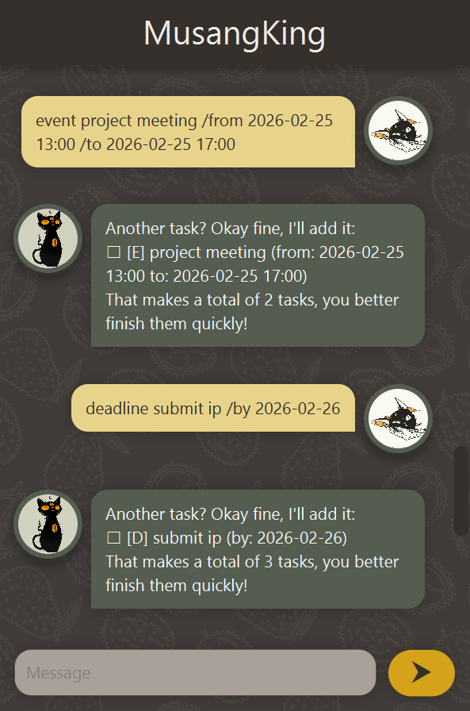

# MusangKing User Guide

Meet Your Productivity Companion: MusangKing! Struggling to keep track of your tasks,
deadlines, and events? MusangKing is here to ~whip you into shape~ simplify your day
and help you stay organized — all through a simple, easy-to-use chat interface.




## Quick Start

1. Ensure you have Java 17 or above installed in your computer. 
2. Download the latest .jar from [here](https://github.com/TwoBitNoodles/ip/releases).
3. Copy the file to the folder you want to use as the home folder for your personal MusangKing.
4. Open a command terminal, `cd` into the aforementioned folder, and use the `java -jar addressbook.jar` command to run the application.


## Features

Here are all the things you can do with MusangKing!


### Viewing help: `help`

Displays a list of valid commands and what they do.
Format: `help`
Expected output:
```
todo <desc>:
creates a new todo-type task with the description <desc>.

deadline <desc> /by <by>:
creates a new deadline-type task with the 
description <desc>, due by <by>. <by> must be in the following format: YYYY-MM-DD

event <desc> /from <start> /to <end>:
creates a new event-type task with the 
description <desc>, that starts at <start> 
and ends at <end>. <start> and <end> must be in 
the following format: YYYY-MM-DD HH:MM

edit <i> <field> /change <change>:
updates the <field> field of the <i>th task with <change>.

list:
displays the current list of tasks.

find <key>:
lists tasks with descriptions containing <key>.

mark <i>:
marks the <i>th task as done.

unmark <i>:
marks the <i>th task as not done yet.

delete <i>:
deletes the <i>th task.

help:
displays a list of valid commands and what they do.
```


### Adding todo tasks: `todo`

Adds a todo-type task to the current list of tasks.
Format: todo <desc>

Example: `todo do the laundry`
Expected output:
```
Another task? Okay fine, I'll add it:
☐ [T] do the laundry
That makes a total of <n> tasks, you better finish them quickly!
```


### Adding deadlines: `deadline`

Adds a deadline-type task to the current list of tasks.
Format: deadline <desc> /by <date>
Note: <date> must be entered in the following format: YYYY-MM-DD.

Example: `deadline submit ip /by 2026-02-26`
Expected output:
```
Another task? Okay fine, I'll add it:
☐ [D] submit ip (by: 2026-02-26)
That makes a total of <n> tasks, you better finish them quickly!
```


### Adding events: `event`

Adds an event-type task to the current list of tasks.
Format: event <desc> /from <start> /to <end>
Note: <start> and <end> must be entered in the following format: YYYY-MM-DD HH:MM.

Example: `event project meeting /from 2026-02-25 13:00 /to 2026-02-25 17:00`
Expected output:
```
Another task? Okay fine, I'll add it:
☐ [E] project meeting (from: 2026-02-25 13:00 to: 2026-02-25 17:00)
That makes a total of <n> tasks, you better finish them quickly!
```


### Editing tasks: `edit`

Edits the `<i>`th task by updating its <field> field with <change>.
Format: `edit <i> <field> /change <change>`
Example: `edit <i> desc /change buy groceries`
Expected output:
```
What do you need to change this task for? Tsk... so troublesome... here is the updated task:
☐ [T] buy groceries 
```


### Listing tasks: `list`

Displays the current list of tasks, in order of when each task was added to the list.
Format: `list`
Example output:
```
OKOK here are ALLL your tasks:

1. ☐ [T] buy groceries
2. ☐ [D] submit ip (by: 2026-02-26)
3. ☐ [E] project meeting (from: 2026-02-25 13:00 to: 2026-02-25 17:00)

```
### Finding tasks: `find`

Lists tasks with descriptions containing `<key>`.
Format: `find <key>`
Example: `find ip`
Expected output:
```
Are any of these what you're looking for?

1. ☐ [D] submit ip (by: 2026-02-26)

```


### Marking tasks: `mark`

Marks the `<i>`th task as done.
Format: `mark <i>`
Example: `mark 1`
Expected output:
```
It's about time! What took you so long?
☑ [T] buy groceries
```


### Unmarking tasks: `unmark`

Marks the `<i>`task as not done yet.
Format: `unmark <i>`
Example: `unmark 2`
Expected output:
```
Huh? Still not done with this one?
☐ [E] project meeting (from: 2026-02-25 13:00 to: 2026-02-25 17:00)
```


### Deleting tasks: `delete`

Deletes the `<i>`the task.
Format: `delete <i>`
Example: `delete 1`
Expected output:
```
This task is gone, forever. (A long time).
☑ [T] buy groceries
You still have <n> tasks left. Don't slack off!
```


## Credits
The images used for the chatbot avatars were originally created by [cellsdividing](https://www.instagram.com/cellsdividing/).

The background image was initially obtained from [vecteezy](https://www.vecteezy.com/vector-art/11712585-durian-fruit-seamless-pattern-hand-drawn-in-doodle-style-wrapping-paper-background-wallpaper-textile),
then edited by myself.